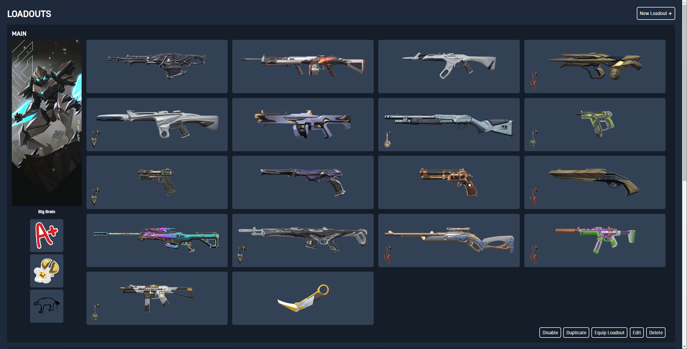
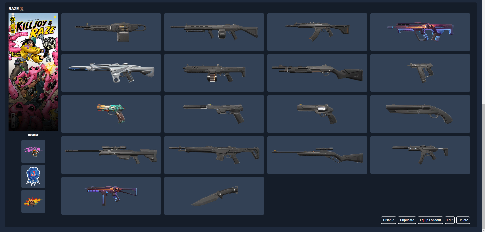

# ValPal

I've created this project to allow Valorant players to create loadouts which can be randomized when joining a game. It supports agent specific loadouts, player cards, player titles, sprays, buddies, skin levels, and skin chromas.

# Screenshots

Configurator main screen showing a loadout

Configurator main screen showing an agent specific loadout

# Installation

1. You can find the latest release [here](https://github.com/zachrip/valpal/releases/latest) - download valpal.exe
2. Create a folder somewhere (desktop or your user directory, or wherever else, you do you)
3. Run the .exe - windows will probably complain, click "more info" then "run anyway"
4. You should see an item added to your system tray - right click on it and click "Open ValPal" - this will open your browser to the configurator
5. Open Valorant (you must run the game for this to work)
6. Add a loadout and configure it with your skins
7. When you join a match, the app will detect when you've locked in as an agent. If you have `Agent specific loadouts` enabled it will configure loadouts for that agent if there are any (otherwise it will fall back to all enabled loadouts). You can disable the loadout shuffling all together if you prefer to equip loadouts by hand in the configurator

# Architecture

This app is based around [Remix](https://remix.run) and packaged using [pkg](https://github.com/vercel/pkg). It uses the local websocket/http server that Valorant runs to authenticate and detect when matches start.

# Contribute

1. Clone this repo
2. `npm install`
3. `npm run dev`
4. Run Valorant
5. Open [http://localhost:3000](http://localhost:3000)
6. The configurator code mostly lives in app/ - the rest of the stuff is in server/ (such as the game detection, system tray stuff, etc)
